# Dự Báo Giá Cổ Phiếu FPT: LTSF-Linear + HMM Regime-Switching

# I. Giới thiệu

Đây là bài viết chia sẻ giải pháp của nhóm trong cuộc thi **[AIO-2025: LTSF-Linear Forecasting Challenge](https://www.kaggle.com/competitions/aio-2025-linear-forecasting-challenge)** trên Kaggle.

**Mục tiêu cuộc thi:** Dự báo giá đóng cửa cổ phiếu FPT trong **100 ngày tiếp theo**. Thay vì dựa vào các mô hình deep learning phức tạp, thử thách khuyến khích người tham gia khám phá sức mạnh của các **mô hình tuyến tính** như Linear, NLinear và DLinear khi áp dụng vào dữ liệu tài chính thực tế.

## Thách thức chính

| Thách thức | Mô tả |
|------------|-------|
| **Long-term Forecasting** | Dự báo 100 ngày, không phải 1-7 ngày như thông thường |
| **Distribution Shift** | Giá cổ phiếu thay đổi range theo thời gian |
| **Market Regimes** | Thị trường có các trạng thái ẩn: ổn định, biến động, chuyển đổi |
| **Data Constraint** | Chỉ được dùng mỗi Data train, không có xài data ngoài |

## Giải pháp của nhóm

Nhóm kết hợp 3 kỹ thuật chính:

1. **RevIN (Reversible Instance Normalization)**: Xử lý distribution shift bằng cách normalize đầu vào và denormalize đầu ra

2. **HMM Regime Detection**: Sử dụng Hidden Markov Model để phát hiện trạng thái thị trường (Stable / Transition / Volatile)

3. **Regime-Specific Models**: Train model riêng cho mỗi regime, dự báo dựa trên điều kiện thị trường hiện tại

## Kết quả đạt được hiện tại

| Rank | Method | Hidden MSE | Ghi chú |
|------|--------|-----------|---------|
| 1 | Univariate DLinear | **34** | Best overall |
| 2 | Univariate Linear | 36 | |
| 3 | Multivariate DLinear | 51 | Best với HMM |


---

# II. Các thách thức

## 1. Long-term Forecasting

Dự báo 100 ngày là một thách thức lớn so với các bài toán dự báo ngắn hạn (1-7 ngày). Có hai phương pháp chính:

### Direct Forecasting (Multi-output)
- Train **nhiều model riêng biệt**, mỗi model dự báo một bước thời gian cụ thể
- Model 1 dự báo T+1, Model 2 dự báo T+2, ..., Model 100 dự báo T+100
- **Ưu điểm:** Không tích lũy error
- **Nhược điểm:** Cần train nhiều model, không capture được dependency giữa các bước

### Recursive Forecasting (Autoregressive)
- Train **một model duy nhất** dự báo bước tiếp theo
- Dùng prediction làm input để dự báo tiếp theo
- **Ưu điểm:** Một model, capture được dependency
- **Nhược điểm:** Error tích lũy theo thời gian

<p align="center">
  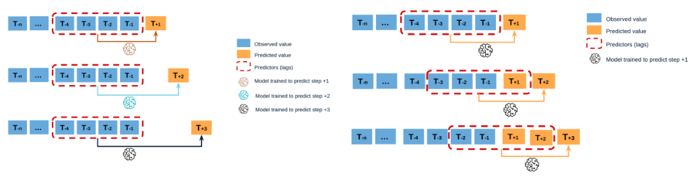
  <br><em>Hình 1. So sánh Direct (trái) và Recursive (phải) Forecasting. (Nguồn: AI Viet Nam)</em>
</p>

**Trong project này:** Nhóm mình sử dụng **Direct Forecasting** - model dự báo trực tiếp 100 ngày một lần mà không cần recursive.

## 2. Distribution Shift

**Distribution shift** là hiện tượng phân phối dữ liệu thay đổi theo thời gian. Trong dữ liệu FPT, điều này thể hiện rõ ràng:

<p align="center">
  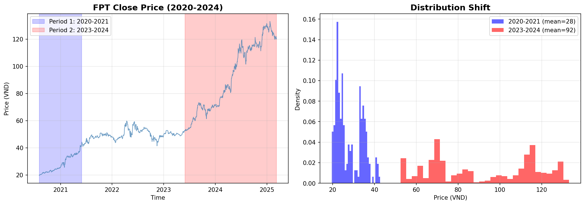
  <br><em>Hình 2. Distribution Shift trong dữ liệu FPT: Phân phối giá 2020-2021 hoàn toàn khác với 2023-2024.</em>
</p>

Như hình trên cho thấy:
- **Period 1 (2020-2021):** Giá dao động trong khoảng thấp
- **Period 2 (2023-2024):** Giá đã tăng lên mức cao hơn nhiều

Mặc dù **pattern biến động vẫn tương tự**, nhưng **scale đã thay đổi hoàn toàn**. Model học trên dữ liệu cũ sẽ dự báo sai scale nếu không xử lý.

**Giải pháp:** RevIN (Reversible Instance Normalization).

## 3. Market Regimes

Thị trường tài chính không hoạt động theo một quy luật duy nhất. Thay vào đó, nó chuyển đổi giữa các **trạng thái (regimes)** khác nhau:

- **Bull Market**: Xu hướng tăng mạnh, volatility thấp
- **Bear Market**: Xu hướng giảm, volatility cao
- **Sideways/Consolidation**: Đi ngang, không có xu hướng rõ ràng
- **Transition**: Giai đoạn chuyển đổi giữa các regime

<p align="center">
  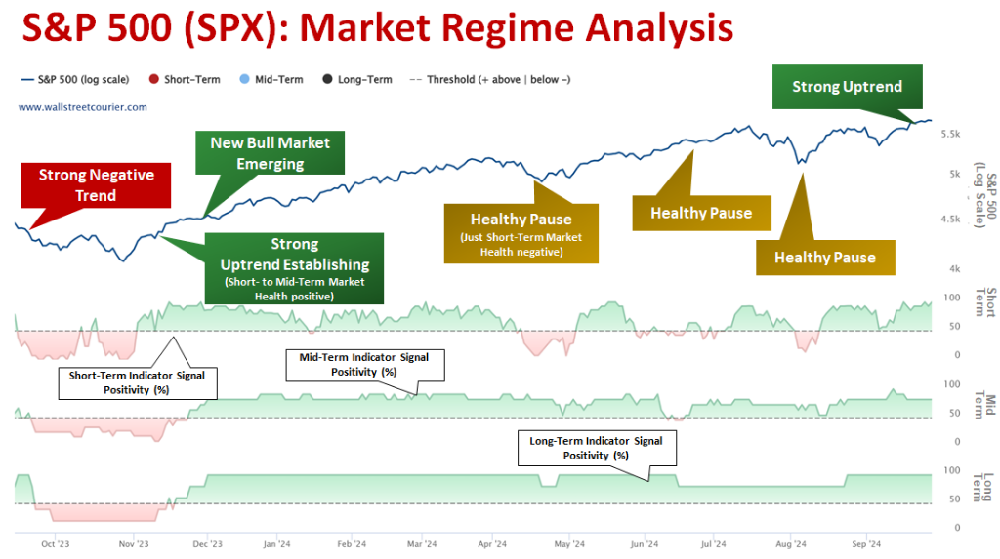
  <br><em>Hình 3. Phân tích Market Regime trên S&P 500 (Nguồn: <a href="https://www.wallstreetcourier.com/spotlights/mrnl_sp-500-outlook-analyzing-the-current-market-regime-of-sp-500-spx/">Wall Street Courier</a>)</em>
</p>

**Vấn đề:** Một model duy nhất khó có thể học được tất cả patterns từ các regime khác nhau. Dữ liệu từ Bull Market có thể "nhiễu" việc học pattern của Bear Market và ngược lại.

**Giải pháp:** HMM Regime-Switching - phát hiện regime và train model chuyên biệt cho từng regime.

## 4. Data Constraint - Này thì không chịu cũng phải chịu 🤣
---

# III. Giải pháp kỹ thuật

## 1. RevIN - Reversible Instance Normalization

### 1.1 Ý tưởng

RevIN là kỹ thuật normalize dữ liệu **có thể đảo ngược**, được thiết kế đặc biệt cho time series với distribution shift. Ý tưởng chính:

1. **Normalize input**: Chuẩn hóa chuỗi đầu vào về mean=0, std=1
2. **Model học**: Model học patterns trên dữ liệu đã chuẩn hóa
3. **Denormalize output**: Khôi phục lại scale gốc cho dự báo

<p align="center">
  
  <br><em>Hình 4. Tác dụng của RevIN. (Nguồn: <a href="https://github.com/ts-kim/RevIN/">RevIN GitHub</a>)</em>
</p>

### 1.2 Thuật toán

<p align="center">
  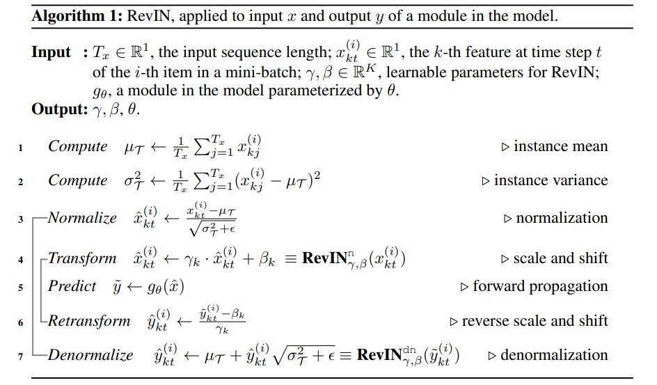
  <br><em>Hình 5. Thuật toán RevIN chi tiết. (Nguồn: <a href="https://github.com/ts-kim/RevIN/">RevIN GitHub</a>)</em>
</p>

### 1.3 Code Implementation

```python
class RevIN(nn.Module):
    def __init__(self, num_features, eps=1e-5, affine=True):
        super().__init__()
        self.eps = eps
        self.affine = affine
        if affine:
            # Bước 4: Learnable parameters γ và β
            self.gamma = nn.Parameter(torch.ones(num_features))
            self.beta = nn.Parameter(torch.zeros(num_features))

    def forward(self, x, mode):
        if mode == 'norm':
            # Bước 1: Compute instance mean
            self.mean = x.mean(dim=1, keepdim=True).detach()
            # Bước 2: Compute instance variance  
            self.std = torch.sqrt(x.var(dim=1, keepdim=True) + self.eps).detach()
            # Bước 3: Normalize
            x = (x - self.mean) / self.std
            # Bước 4: Scale and shift với γ, β
            if self.affine:
                x = x * self.gamma + self.beta
            return x
            
        elif mode == 'denorm':
            # Bước 6: Reverse scale and shift
            if self.affine:
                x = (x - self.beta) / (self.gamma + self.eps)
            # Bước 7: Denormalize về scale gốc
            x = x * self.std + self.mean
            return x
```


### 1.4 Apply vào dữ liệu FPT

<p align="center">
  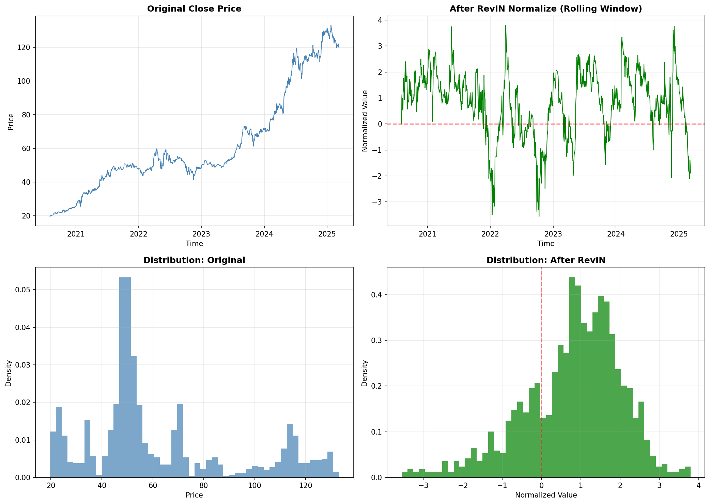
  <br><em>Hình 6. Áp dụng RevIN vào dữ liệu FPT.</em>
</p>

**Phân tích:**
- **Góc trên trái (Original):** Giá FPT có range thay đổi từ ~50 (2020) lên ~130 (2024)
- **Góc trên phải (After RevIN):** Sau normalize, giá dao động quanh 0 với std ≈ 1
- **Góc dưới trái (Distribution Original):** Phân phối lệch phải, nhiều peaks khác nhau
- **Góc dưới phải (Distribution After):** Phân phối gần chuẩn hơn, tập trung quanh 0

**Lợi ích:** Model không còn bị ảnh hưởng bởi sự thay đổi scale theo thời gian.

---

## 2. HMM Regime Detection

### 2.1 Hidden Markov Model

<p align="center">
  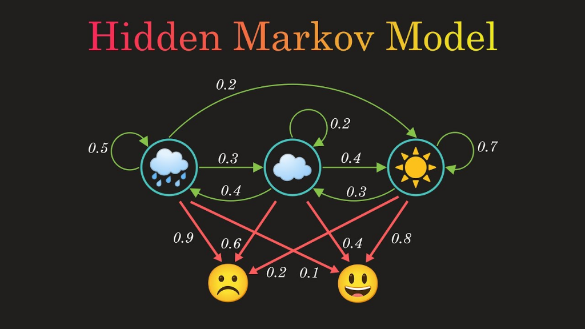
  <br><em>Hình 7. Minh họa Hidden Markov Model với 3 hidden states và 2 observations. (Nguồn: <a href="https://www.youtube.com/watch?v=RWkHJnFj5rY">YouTube</a>)</em>
</p>

HMM là mô hình xác suất trong đó:
- **Hidden states (Regimes):** Trạng thái ẩn mà ta không quan sát trực tiếp (ví dụ: mưa, mây, nắng)
- **Observations:** Các features ta đo được (ví dụ: buồn, vui)
- **Transition Matrix:** Xác suất chuyển giữa các trạng thái (các số 0.2, 0.3, 0.4, ...)

Trong bối cảnh thị trường chứng khoán:
- **Hidden states:** Bull Market, Bear Market, Sideways
- **Observations:** Returns, Volatility, Trend

### 2.2 Features cho HMM

Để HMM có thể phát hiện regime, ta cần cung cấp các features phản ánh "hành vi" thị trường:

| Feature | Công thức | Ý nghĩa |
|---------|-----------|---------|
| **Returns** | $R_t = \frac{Close_t - Close_{t-1}}{Close_{t-1}}$ | Tỷ suất sinh lời ngày, cho biết thị trường tăng hay giảm |
| **Volatility** | $Vol_t = std(R_{t-9}, ..., R_t)$ | Độ biến động 10 ngày, cao = thị trường bất ổn |
| **Trend** | $Trend_t = \frac{MA_{10}(t) - MA_{10}(t-1)}{MA_{10}(t-1)}$ | Xu hướng trung bình động, cho biết trend tăng/giảm |

```python
# Tính toán features
df['returns'] = df['close'].pct_change().fillna(0)
df['volatility'] = df['returns'].rolling(window=10).std().fillna(0)
df['trend'] = df['close'].rolling(window=10).mean().pct_change().fillna(0)
```

<p align="center">
  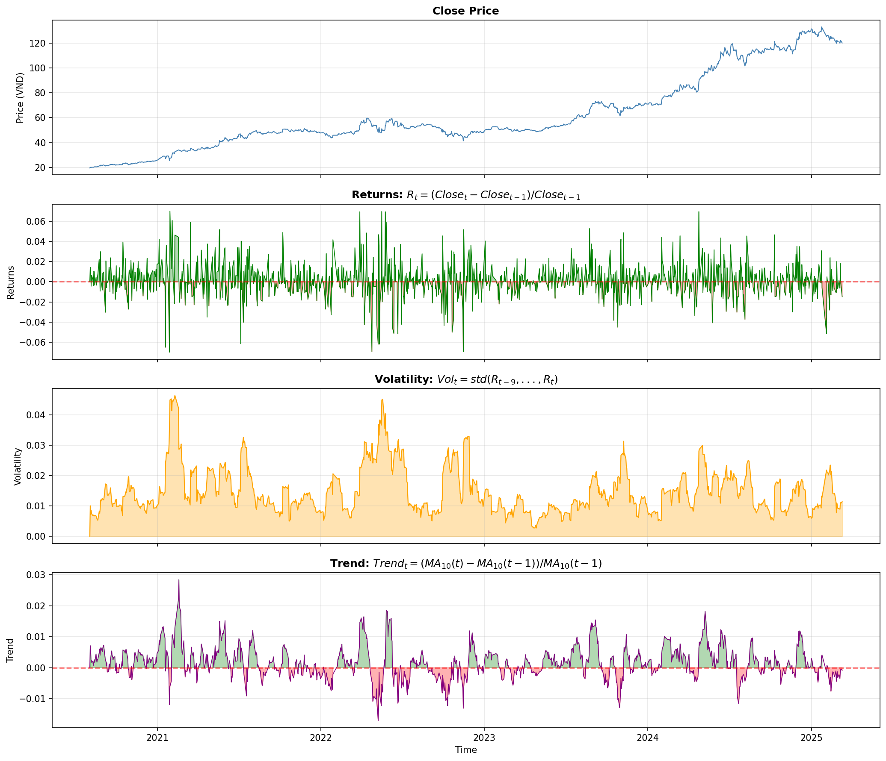
  <br><em>Hình 8. Visualization các features cho HMM trên dữ liệu FPT.</em>
</p>

**Nhận xét từ hình:**
- **Returns:** Dao động quanh 0, có các spike lớn vào thời điểm biến động mạnh
- **Volatility:** Tăng cao vào các giai đoạn bất ổn (2020, 2022), thấp khi thị trường ổn định
- **Trend:** Cho thấy xu hướng tăng/giảm rõ ràng hơn so với returns

### 2.3 Regime Window

**Regime Window** là số ngày đầu tiên bị bỏ qua khi detect regimes:

```python
class RegimeDetector:
    def __init__(self, n_components=3, window=30):
        self.window = window
        
    def fit(self, df):
        # Bỏ qua `window` ngày đầu
        features = df[['returns', 'volatility', 'trend']].iloc[self.window:].values
        self.model.fit(features)
```

**Tại sao cần Regime Window?**
- Các features như `volatility` và `trend` cần rolling window để tính toán
- Những ngày đầu tiên có giá trị NaN hoặc không ổn định
- `window=30` → bỏ 30 ngày đầu, đảm bảo features đã ổn định

**Giá trị thường dùng:** 30, 60

<p align="center">
  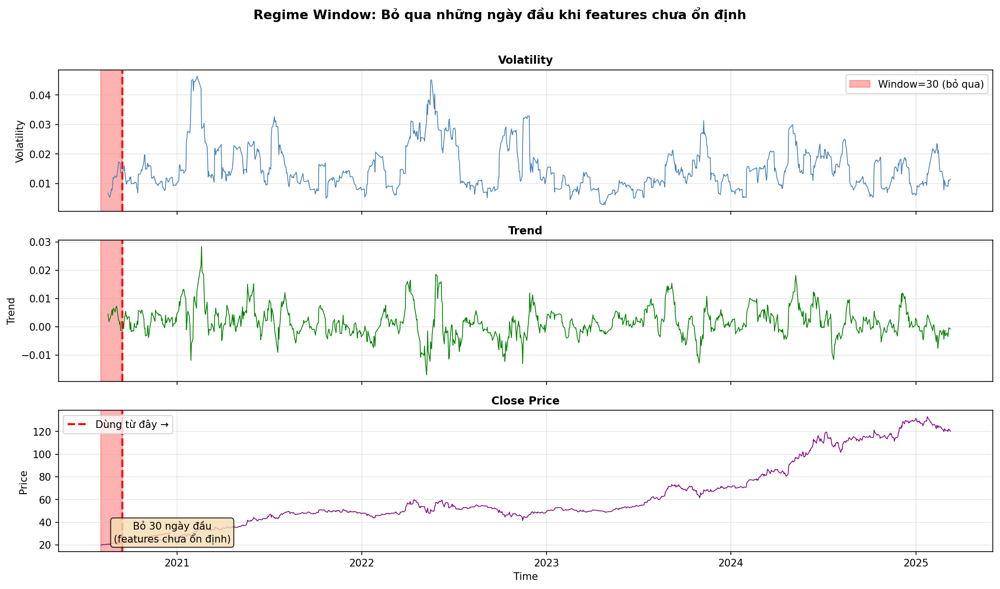
  <br><em>Hình 9. Regime Window: Bỏ qua 30 ngày đầu khi features chưa ổn định.</em>
</p>

### 2.4 Chọn số lượng Regimes

Câu hỏi: Nên dùng bao nhiêu regimes? 3? 4? 5?

#### N = 3 Regimes

<p align="center">
  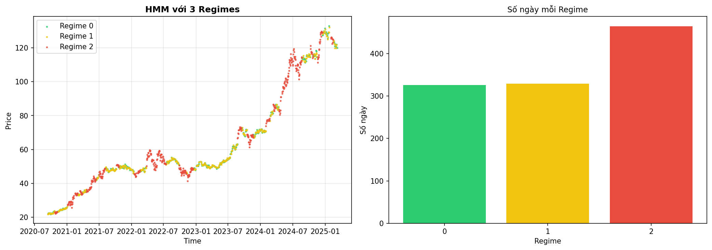
  <br><em>Hình 10. HMM với 3 Regimes trên dữ liệu FPT.</em>
</p>

**Phân tích:**
- **Regime 0 (Xanh lá):** Thường xuất hiện khi thị trường ổn định, volatility thấp
- **Regime 1 (Vàng):** Giai đoạn chuyển đổi, thường thấy trước khi thị trường đổi hướng
- **Regime 2 (Đỏ):** Thị trường biến động mạnh, có thể là crash hoặc rally mạnh

**Nhận xét:** Phân chia 3 regime khá rõ ràng, mỗi regime có đủ samples để train model.

#### N = 4 Regimes

<p align="center">
  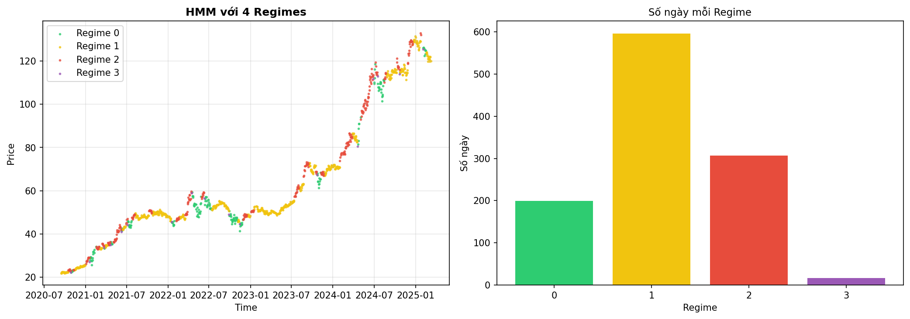
  <br><em>Hình 11. HMM với 4 Regimes trên dữ liệu FPT.</em>
</p>

**Phân tích:**
- Phân chia chi tiết hơn với 4 trạng thái
- Một số regime có thể có ít samples, gây khó khăn cho training
- Có thể bắt được nhiều chi tiết hơn, nhưng cũng dễ overfit

**Trade-off:**

| N Regimes | Ưu điểm | Nhược điểm |
|-----------|---------|------------|
| **N = 2** | Đơn giản, nhiều samples/regime | Quá thô, bỏ sót chi tiết |
| **N = 3** | Cân bằng, phổ biến | Có thể không đủ chi tiết |
| **N = 4+** | Chi tiết hơn | Ít samples/regime, dễ overfit |

**Trong project này:** Nhóm chọn **N = 3** vì:
1. Đủ chi tiết để phân biệt bull/bear/transition
2. Mỗi regime có đủ samples để train

### 2.5 Lưu ý quan trọng

> **⚠️ HMM không thể predict regime cho future!**
> 
> HMM chỉ có thể predict regime dựa trên observations (returns, volatility, trend). Với 100 ngày tương lai, ta chưa có observations → không thể predict regime.
>
> **Giải pháp:** Giả định regime hiện tại (`regimes[-1]`) tiếp tục trong 100 ngày forecast.

---

## 3. LTSF-Linear Models

### 3.1 RLinear (Linear + RevIN)

<p align="center">
  
  <br><em>Hình 12. Kiến trúc Linear + RevIN: RevIN → Linear → Denormalize.</em>
</p>

**Kiến trúc:**
1. **RevIN Normalize**: Chuẩn hóa input về mean=0, std=1
2. **Linear Layer**: Một lớp fully-connected ánh xạ từ `seq_len` → `pred_len`
3. **Denormalize**: Khôi phục scale gốc cho output

**Công thức:**
$$\hat{y} = W \cdot x_{norm} + b$$
$$y = \hat{y} \cdot \sigma + \mu$$

Trong đó $W \in \mathbb{R}^{pred\_len \times seq\_len}$.

```python
class Linear(nn.Module):
    def __init__(self, seq_len, pred_len, num_features):
        super().__init__()
        self.revin = RevIN(num_features)
        self.linear = nn.Linear(seq_len, pred_len)
        
    def forward(self, x):
        # RevIN normalize
        x = self.revin(x, 'norm')
        
        # Linear projection
        out = self.linear(x[:, :, 0])  # Univariate: chỉ dùng close
        
        # RevIN denormalize
        out = self.revin(out.unsqueeze(-1), 'denorm').squeeze(-1)
        return out
```

### 3.2 RDLinear (DLinear + RevIN)

<p align="center">
  
  <br><em>Hình 13. Kiến trúc DLinear + RevIN: Decomposition thành Trend + Seasonal.</em>
</p>

**Ý tưởng:** Tách chuỗi thời gian thành 2 thành phần:
- **Trend**: Xu hướng dài hạn (tính bằng Moving Average)
- **Seasonal**: Biến động ngắn hạn (phần còn lại)

**Công thức:**
$$x_{trend} = \text{MovingAvg}(x, kernel)$$
$$x_{seasonal} = x - x_{trend}$$
$$\hat{y} = W_t \cdot x_{trend} + W_s \cdot x_{seasonal}$$

```python
class DLinear(nn.Module):
    def __init__(self, seq_len, pred_len, num_features, kernel_size=25):
        super().__init__()
        self.revin = RevIN(num_features)
        self.moving_avg = nn.AvgPool1d(kernel_size, stride=1, padding=kernel_size//2)
        self.linear_trend = nn.Linear(seq_len, pred_len)
        self.linear_seasonal = nn.Linear(seq_len, pred_len)
        
    def forward(self, x):
        # RevIN normalize
        x = self.revin(x, 'norm')
        x_in = x[:, :, 0]  # Univariate
        
        # Decomposition
        trend = self.moving_avg(x_in.unsqueeze(1)).squeeze(1)
        seasonal = x_in - trend
        
        # Separate linear projections
        out = self.linear_trend(trend) + self.linear_seasonal(seasonal)
        
        # RevIN denormalize
        out = self.revin(out.unsqueeze(-1), 'denorm').squeeze(-1)
        return out
```

**Tại sao DLinear tốt hơn?**
- Trend và Seasonal có patterns khác nhau → cần weights khác nhau
- Linear đơn phải học cả 2 patterns cùng lúc → khó hơn

---

## 4. Regime-Specific Training

### 4.1 Ý tưởng

Thay vì train **một model duy nhất** trên toàn bộ dữ liệu, ta:
1. Dùng **HMM để phân cụm** dữ liệu thành các regimes (trạng thái thị trường ẩn)
2. **Train một model riêng** trên dữ liệu của từng regime
3. Khi forecast: xác định **regime hiện tại** → chọn model đó → predict

### 4.2 Code

```python
# === TRAINING ===
# 1. Fit HMM trên TRAIN data
hmm = GaussianHMM(n_components=3)
hmm.fit(train_features)  # features = [returns, volatility, trend]

# 2. Predict regimes cho TRAIN + VAL
regimes = hmm.predict(trainval_features)

# 3. Train model riêng cho mỗi regime
models = {}
for r in [0, 1, 2]:
    mask = (regimes == r)
    X_r, y_r = X_trainval[mask], y_trainval[mask]
    
    models[r] = DLinear(seq_len, pred_len, num_features)
    train(models[r], X_r, y_r)

# === PREDICTION ===
# 4. Lấy regime cuối cùng
current_regime = regimes[-1]

# 5. Dùng model tương ứng để predict
prediction = models[current_regime](last_sequence)
```

### 4.3 Tại sao hiệu quả?

| Cách tiếp cận | Vấn đề |
|---------------|--------|
| **1 model cho tất cả** | Phải học cùng lúc pattern của bull, bear, sideways → confused |
| **Model riêng theo regime** | Mỗi model chỉ tập trung học pattern của 1 regime → specialized |

**Ví dụ:**
- **Regime 0 (Stable):** Model học pattern ổn định, volatility thấp
- **Regime 1 (Transition):** Model học các dấu hiệu đổi hướng
- **Regime 2 (Volatile):** Model học cách xử lý biến động mạnh

---

# IV. Luồng xử lý

## Tổng quan Pipeline

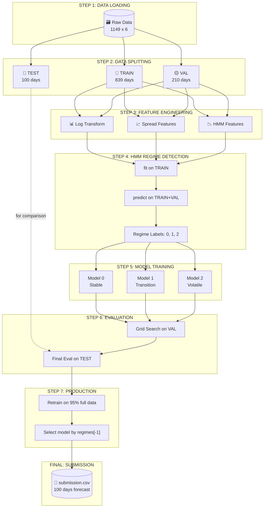

---

## 1. Data Loading

Load dữ liệu OHLCV (Open, High, Low, Close, Volume) từ file CSV:

```python
df = pd.read_csv('data/FPT_train.csv')
# Columns: time, open, high, low, close, volume
# 1149 rows (days)
```

---

## 2. Feature Engineering

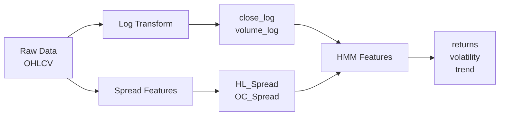

### 2.1 Log Transform

Áp dụng log transform cho `close` và `volume` để ổn định phương sai:

```python
df['close_log'] = np.log(df['close'])
df['volume_log'] = np.log(df['volume'] + 1)
```

**Tại sao?** Dữ liệu tài chính thường có phân phối lệch phải. Log transform giúp:
- Ổn định phương sai
- Dễ học pattern hơn

### 2.2 Spread Features

<p align="center">
  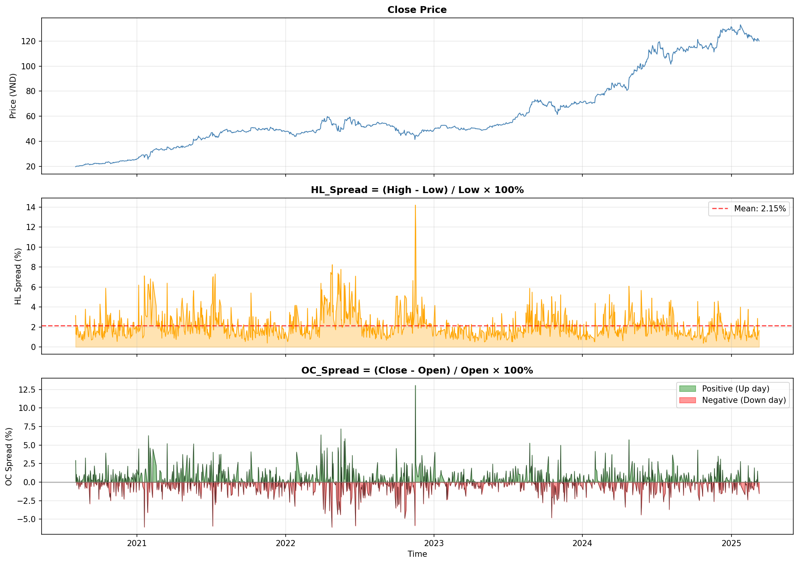
  <br><em>Hình 14. Visualization các Spread Features trên dữ liệu FPT.</em>
</p>

**HL_Spread (High-Low Spread):**
$$HL\_Spread = \frac{High - Low}{Low} \times 100\%$$

- Đo **độ biến động trong ngày**
- Cao → thị trường biến động mạnh
- Thấp → thị trường ổn định

**OC_Spread (Open-Close Spread):**
$$OC\_Spread = \frac{Close - Open}{Open} \times 100\%$$

- Đo **xu hướng trong ngày**
- Dương (xanh) → ngày tăng
- Âm (đỏ) → ngày giảm

```python
df['HL_Spread'] = (df['high'] - df['low']) / df['low']
df['OC_Spread'] = (df['close'] - df['open']) / df['open']
```

### 2.3 HMM Features

Như đã trình bày ở phần III.2:

```python
df['returns'] = df['close'].pct_change()
df['volatility'] = df['returns'].rolling(window=10).std()
df['trend'] = df['close'].rolling(window=10).mean().pct_change()
```

---

## 3. Data Splitting

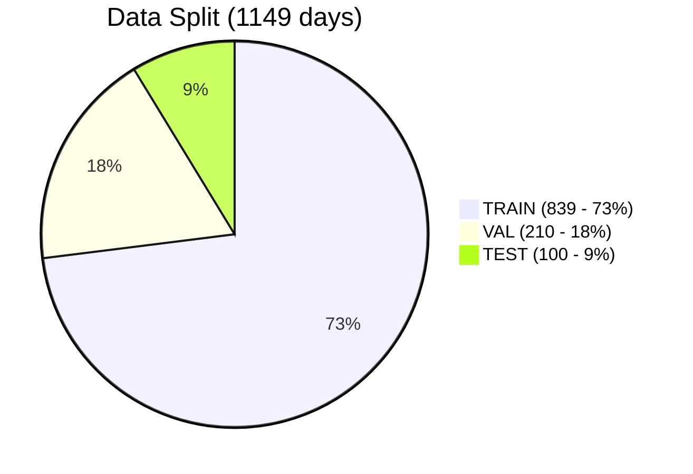

| Split | Days | Mục đích |
|-------|------|----------|
| **TRAIN** | 839 (73%) | Train model |
| **VAL** | 210 (18%) | Early stopping, tuning |
| **TEST** | 100 (9%) | Đánh giá cuối cùng |

---

## 4. HMM Regime Detection

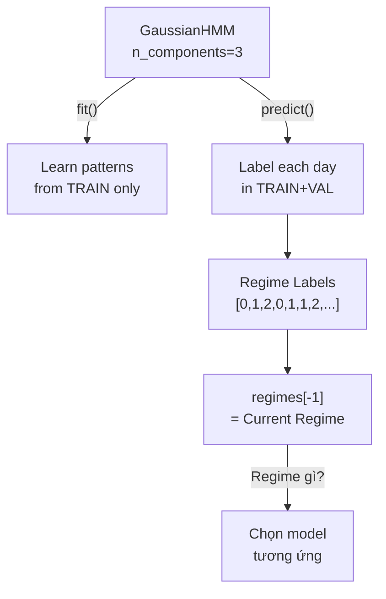

> ⚠️ **LƯU Ý QUAN TRỌNG: Tránh Data Leakage**
> 
> - **fit()** CHỈ trên TRAIN → để học patterns
> - **predict()** trên TRAIN+VAL → để có regime labels cho cả 2
> - KHÔNG predict được trên TEST vì chưa có data!

```python
# Fit HMM CHỈ trên TRAIN
hmm = RegimeDetector(n_components=3)
hmm.fit(train_df)

# Predict trên TRAIN + VAL
regimes = hmm.predict(trainval_df)
```

---

## 5. Model Training (Per Regime)

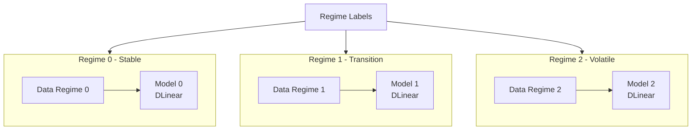

Với mỗi regime, train một model riêng:

```python
for r in [0, 1, 2]:
    mask = (regimes == r)
    X_r, y_r = X_trainval[mask], y_trainval[mask]
    models[r] = DLinear(seq_len, pred_len, num_features)
    train(models[r], X_r, y_r)
```

---

## 6. Evaluation on TEST

Đánh giá model trên TEST set để kiểm tra:

```python
# Lấy regime cuối của TRAINVAL
test_regime = regimes[-1]

# Dùng model tương ứng để predict
predictions = models[test_regime](X_test)

# Tính MSE
test_mse = ((predictions - y_test) ** 2).mean()
```

**Mục đích:** Đảm bảo pipeline hoạt động tốt trước khi submit.

---

## 7. Production & Submission

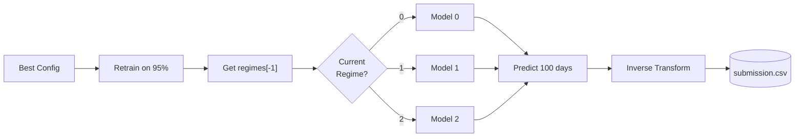

### 7.1 Retrain for Production

Sau khi đã validate xong, retrain trên **95% toàn bộ data**:

```python
# Chia lại data: 95% train, 5% kept for regime detection
production_df = full_df.iloc[:int(len(full_df) * 0.95)]

# Fit HMM lại trên production data
hmm.fit(production_df)
regimes = hmm.predict(production_df)
```

### 7.2 Select Model by Current Regime

```python
# Regime cuối cùng = "tâm lý thị trường" hiện tại
current_regime = regimes[-1]
print(f"Current market regime: {current_regime}")
```

### 7.3 Final Prediction & Submission

```python
# Chọn model tương ứng với current regime
final_model = models[current_regime]

# Predict 100 ngày
last_sequence = get_last_sequence(production_df)
predictions = final_model(last_sequence)

# Inverse transform (nếu dùng log)
predictions = np.exp(predictions)

# Tạo submission
submission = pd.DataFrame({
    'row_id': range(len(predictions)),
    'close': predictions
})
submission.to_csv('submission.csv', index=False)
```

---

# V. Kết quả đánh giá

> **Mẹo:** Dữ liệu FPT có thể cào được từ thư viện **Vnstock**, nên nhóm đã cào hidden test về để đánh giá chi tiết hơn.

## Bảng kết quả

| # | Model | Config | Hidden MSE | Train MSE | Nhận xét |
|---|-------|--------|------------|-----------|----------|
| 1 | **Univariate** | DLinear \| Seq480 | **34.55** | 4118 | 🥇 Tốt nhất |
| 2 | Univariate | Linear \| Seq480 | 39.33 | 4188 | 🥈 |
| 3 | Multivariate | DLinear \| Seq60 | 56.35 | 550 | HMM giúp ích |
| 4 | Multivariate | Linear \| Seq60 | 64.64 | 633 | HMM giúp ích |
| 5 | Univariate | DLinear \| Seq60 | 203.53 | 179 | Overfitting |
| 6 | Univariate | Linear \| Seq60 | 205.47 | 182 | Overfitting |
| 7 | Multivariate | DLinear \| Seq60 | 249.19 | 193 | NoHMM - kém |
| 8 | Multivariate | Linear \| Seq60 | 253.08 | 195 | NoHMM - kém |
| ... | ... | ... | ... | ... | ... |

<p align="center">
  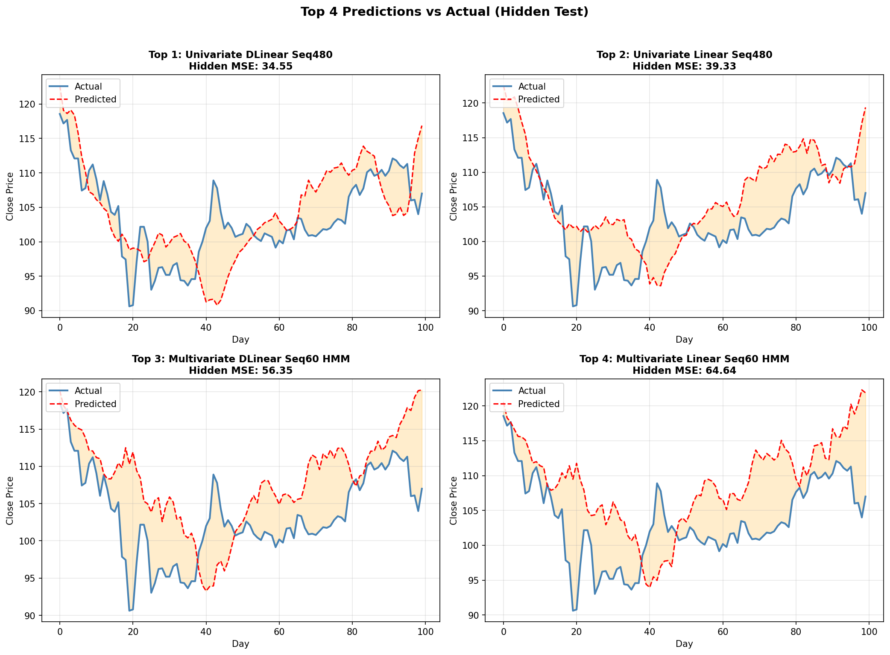
  <br><em>Hình 15. So sánh Top 4 predictions với actual values trên hidden test.</em>
</p>

## Phân tích chi tiết

### Top 1-2: Univariate + Seq480 

```
Univariate DLinear Seq480: TrainMSE=4118, HiddenMSE=34.55
Univariate Linear Seq480:  TrainMSE=4188, HiddenMSE=39.33
```

**Tại sao trainMSE cao nhưng hiddenMSE lại thấp?**

1. **Seq480 = 480 ngày input = ~2 năm dữ liệu**
   - Model nhìn thấy trend dài hạn
   - Ít bị ảnh hưởng bởi nhiễu ngắn hạn
   
2. **Univariate chỉ dùng `close`**
   - Không bị nhiễu từ các features khác


3. **TrainMSE cao = không overfitting**
   - Model học pattern tổng quát thay vì nhớ training data
   - Generalize tốt hơn trên hidden test

### Top 3-4: Multivariate + HMM + Seq60

```
Multivariate DLinear Seq60 + HMM: TrainMSE=550, HiddenMSE=56.35
Multivariate Linear Seq60 + HMM:  TrainMSE=633, HiddenMSE=64.64
```

**Tại sao multivariate với HMM lại khá tốt?**

1. **HMM giúp phân cụm data theo regime**
   - Mỗi model chỉ học pattern của 1 regime
   - Giảm conflict giữa các patterns khác nhau

2. **Multivariate + HMM = combination tốt**
   - Spread features giúp HMM detect regime tốt hơn
   - Model nhận thêm thông tin từ nhiều features

### Univariate + Seq60 (5-6)

```
Univariate DLinear Seq60: TrainMSE=179, HiddenMSE=203.53
Univariate Linear Seq60:  TrainMSE=182, HiddenMSE=205.47
```

**Dấu hiệu overfitting rõ ràng:**

| TrainMSE | HiddenMSE | Ratio |
|----------|-----------|-------|
| 179 | 203.53 | 1.14x |
| 182 | 205.47 | 1.13x |

- **Seq60 = chỉ 60 ngày input = ~3 tháng**
- Model học được patterns ngắn hạn rất tốt (trainMSE thấp)
- Nhưng patterns đó không generalize (hiddenMSE cao)

### Multivariate NoHMM (7-8)

```
Multivariate DLinear Seq60 NoHMM: TrainMSE=193, HiddenMSE=249.19
Multivariate Linear Seq60 NoHMM:  TrainMSE=195, HiddenMSE=253.08
```

**Vấn đề:**
- Không có HMM → model phải học cùng lúc tất cả regimes
- Multivariate thêm noise từ các features
- Kết quả: performance kém hơn univariate

## Kết luận

| Insight | Giải thích |
|---------|------------|
| **Univariate > Multivariate** | Ít noise hơn, tập trung vào target |
| **Seq480 > Seq60** | Nhìn trend dài hạn, tránh overfitting |
| **DLinear > Linear** | Trend-Seasonal decomposition giúp ích |
| **HMM giúp Multivariate** | Phân cụm data giảm conflict |
| **TrainMSE cao ≠ xấu** | Có thể là dấu hiệu của generalization tốt |

---

# Bonus: Kết quả trên VIC

Nhóm cũng áp dụng pipeline tương tự cho cổ phiếu **VIC (Vingroup)**:

## Dữ liệu VIC

<p align="center">
  
  <br><em>Hình 16. Dữ liệu VIC: Train (xanh) vs Hidden Test (cam).</em>
</p>

**Đặc điểm VIC khác FPT:**
- Downtrend dài từ 2019-2023 (~120 → ~40)
- Hidden test có rally mạnh (~40 → ~120)
- **Thách thức lớn:** Model train trên downtrend, phải predict uptrend!

## So sánh các predictions

<p align="center">
  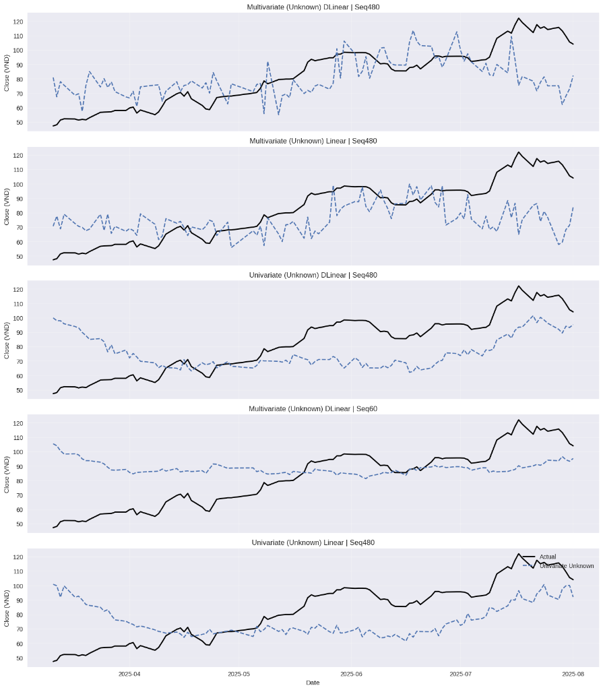
  <br><em>Hình 17. So sánh predictions của các models trên VIC hidden test.</em>
</p>

**Nhận xét:**
- Tất cả models đều **underestimate** rally mạnh của VIC
- Điều này hợp lý vì:
  - Model chỉ thấy downtrend trong training data
  - Không có thông tin gì về catalyst (news, events) gây rally
  - **Regime shift** từ bearish → bullish không được capture

**Bài học:**
> LTSF-Linear (và các technical models nói chung) chỉ có thể dự đoán dựa trên **historical patterns**. Khi có **regime change** mạnh (fundamental shifts), models sẽ khó predict chính xác.

---

# VI. Kết luận

## Tóm tắt

Trong project này, nhóm đã:

1. **Áp dụng LTSF-Linear** cho bài toán dự đoán giá cổ phiếu
2. **Sử dụng RevIN** để xử lý distribution shift
3. **Kết hợp HMM Regime-Switching** để phân cụm market states
4. **Grid Search** để tìm config tốt nhất

## Findings chính

| Finding | Giải thích |
|---------|------------|
| **Univariate DLinear Seq480 = Best** | Đơn giản, nhìn trend dài hạn |
| **HMM giúp Multivariate** | Phân cụm giảm conflict |
| **TrainMSE không phải tất cả** | Cần đánh giá trên unseen data |

## Hạn chế

- **Regime assumption:** Giả định regime cuối cùng tiếp tục trong 100 ngày
- **No external factors:** Không có news, events, macro data
- **Linear models:** Có thể miss non-linear patterns

## Hướng phát triển

1. Thêm **external features** (sentiment, news)
2. Thử **ensemble** multiple regimes
3. Combine với **Transformer-based** models

---

**🎉 Cảm ơn bạn đã đọc!**

