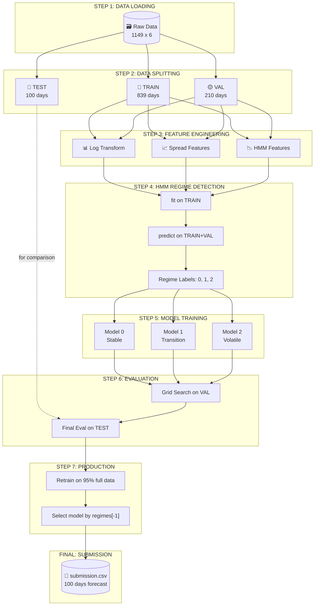
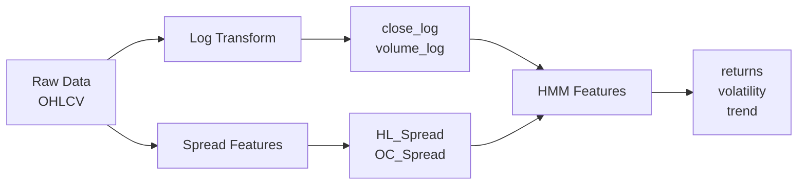
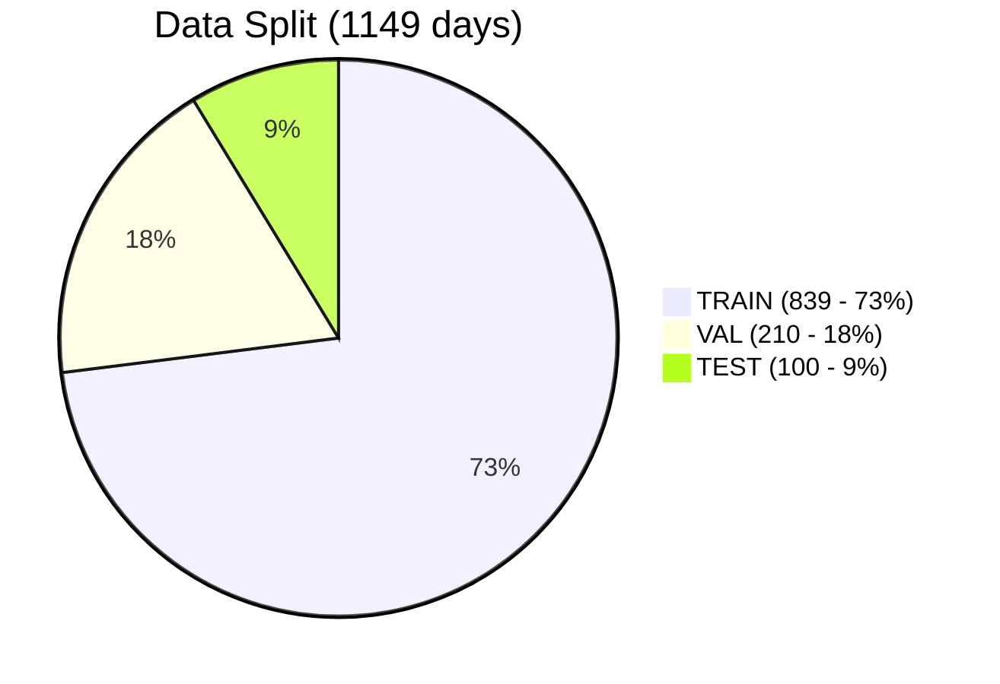
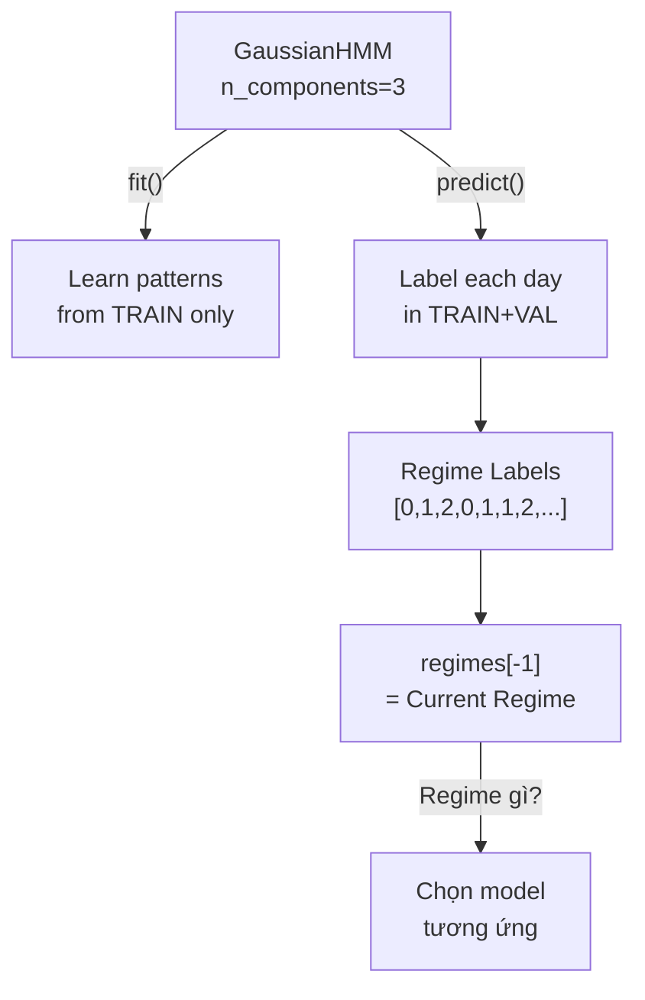
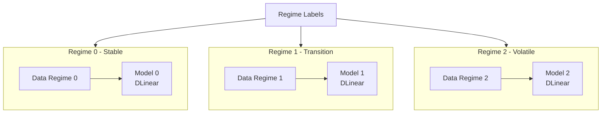
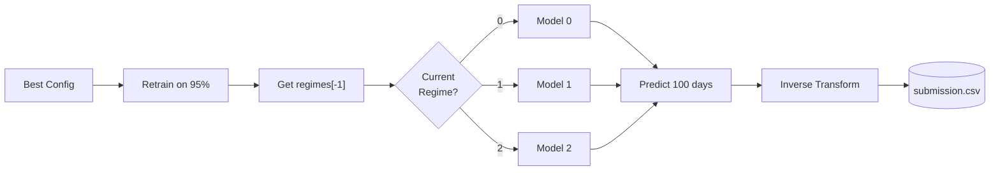

# 📈 Dự Đoán Giá Cổ Phiếu - LTSF-Linear với HMM Regime-Switching


## 📖 Tổng Quan

Dự án dự đoán giá đóng cửa cổ phiếu (**FPT**, **VIC**) trong **100 ngày tiếp theo** sử dụng **LTSF-Linear** kết hợp **HMM Regime-Switching**.

### Ý tưởng chính

```
┌─────────────────────────────────────────────────────────────────┐
│  HMM REGIME-SWITCHING APPROACH                                  │
├─────────────────────────────────────────────────────────────────┤
│  1. HMM phát hiện "tâm lý thị trường" ẩn (regimes)              │
│     - Regime 0: Stable (volatility thấp)                        │
│     - Regime 1: Transition                                      │
│     - Regime 2: Volatile (volatility cao)                       │
│                                                                 │
│  2. Train model RIÊNG cho từng regime                           │
│     → Model học pattern của từng điều kiện thị trường           │
│                                                                 │
│  3. Predict dựa trên current regime (regime ngày cuối)          │
│     → Dùng model phù hợp với điều kiện hiện tại                 │
└─────────────────────────────────────────────────────────────────┘
```

## 🚀 Tính Năng Chính

| Feature | Mô tả |
|---------|-------|
| **Models** | Linear, DLinear (Trend/Seasonal decomposition) |
| **Variants** | Univariate (close only) / Multivariate (close, volume, spreads) |
| **RevIN** | Reversible Instance Normalization - xử lý distribution shift |
| **HMM** | Hidden Markov Model - phân loại regime thị trường |
| **Grid Search** | Tự động thử hàng trăm tổ hợp tham số |

## 🔄 Pipeline Chi Tiết

### Tổng quan Flow



### Step 1: Feature Engineering



### Step 2: Data Splitting



> **Phân chia dữ liệu:**
> - **TRAIN**: Để train model
> - **VAL**: Để early stopping và tuning hyperparameters
> - **TEST**: Để đánh giá cuối cùng trước khi submit (internal test)
> - **Production**: Retrain trên 95% data (TRAIN+VAL+TEST) trước khi submit

### Step 3: HMM Regime Detection



> ⚠️ **QUAN TRỌNG:**
> - HMM fit CHỈ trên TRAIN → tránh data leakage
> - HMM predict trên TRAIN+VAL → để có regime labels
> - KHÔNG predict được trên TEST vì chưa có data!
> - `regimes[-1]` = regime ngày cuối → **GIẢ ĐỊNH** test cùng regime

### Step 4: Train Regime Models



> **Model học được pattern riêng cho từng Regime**

### Step 5: Grid Search & Validation

| Hyperparameter | Values |
|----------------|--------|
| `seq_len` | 60, 480 |
| `model` | Linear, DLinear |
| `variant` | Univariate, Multivariate |
| `n_regimes` | 3 |
| `regime_window` | 30, 60 |

**Evaluation:**
- Train models trên TRAIN
- Đánh giá MSE trên VAL
- Early stopping dựa trên VAL loss
- Chọn config có ValMSE thấp nhất

### Step 6: Production & Forecast



## 📂 Cấu Trúc Dự Án

```
Project-6.1/
├── FPT_LTSF_GridSearch_Extended.ipynb   # Grid Search cho FPT
├── VIC_LTSF_GridSearch_Extended.ipynb   # Grid Search cho VIC
├── data/
│   ├── FPT_train.csv                    # Data FPT
│   ├── VIC_train.csv                    # Data VIC (train)
│   └── VIC_hidden_test.csv              # Data VIC (hidden test)
├── submissions/                          # Kết quả dự đoán
├── scripts/
│   └── debug_hmm_regimes.py             # Debug HMM visualization
└── README.md
```

## 🛠️ Cài Đặt

```bash
pip install torch pandas numpy scikit-learn hmmlearn matplotlib seaborn tqdm
```

## 📖 Hướng Dẫn Sử Dụng

### 1. Chuẩn bị data (nếu cần tách hidden test)

```bash
# Tách 100 ngày cuối làm hidden test
python -c "
import pandas as pd
df = pd.read_csv('data/VIC.csv')
df.iloc[:-100].to_csv('data/VIC_train.csv', index=False)
df.iloc[-100:].to_csv('data/VIC_hidden_test.csv', index=False)
"
```

### 2. Chạy Grid Search

Mở notebook tương ứng (FPT hoặc VIC) và chạy **Run All**.

Kết quả được lưu vào `submissions/` với format:
```
Sub_Multivariate_DLinear_HMM3W60_Seq60_MSE1234.csv
```

## 🧠 Chi Tiết Phương Pháp

### Feature Engineering

| Feature | Công thức | Công dụng |
|---------|-----------|-----------|
| **close_log** | `ln(close + 1)` | Stabilize variance |
| **HL_Spread** | `ln(high) - ln(low)` | Intraday volatility |
| **OC_Spread** | `ln(close) - ln(open)` | Price momentum |
| **returns** | `pct_change(close)` | For HMM |
| **volatility** | `rolling_std(returns)` | For HMM |
| **trend** | `pct_change(rolling_mean)` | For HMM |

### HMM Regime Detection

```python
class RegimeDetector:
    def fit(self, df_train):
        """Fit HMM trên train data only (avoid leakage)"""
        features = df[['returns', 'volatility', 'trend']]
        self.model.fit(features)
    
    def predict(self, df_full):
        """Predict regimes cho toàn bộ data"""
        return self.model.predict(features)
```

**Flow khi predict:**
1. `regimes = detector.predict(df)` → lấy regime cho mỗi ngày
2. `current_regime = regimes[-1]` → regime ngày cuối
3. `regime_model = models[current_regime]` → model tương ứng
4. `prediction = regime_model(last_sequence)` → kết quả

### Regime-Specific Training

```python
# Chia training data theo regime
for regime in [0, 1, 2]:
    mask = (regime_indices == regime)
    X_regime, y_regime = X_train[mask], y_train[mask]
    
    # Train model riêng cho regime này
    regime_models[regime] = train_model(X_regime, y_regime)
```

## 📊 Kết Quả & Insights

### Tại sao HMM Regime-Switching hiệu quả?

1. **Chuyên biệt hóa**: Thay vì 1 model học mọi pattern → nhiều models chuyên biệt
2. **Context-aware**: Prediction dựa trên điều kiện thị trường hiện tại
3. **Giảm noise**: Model chỉ học từ data có cùng đặc tính

### Grid Search Results (Example)

| Rank | Config | ValMSE | Hidden MSE |
|------|--------|--------|------------|
| 1 | Multi_DLinear_HMM3W60_Seq60 | 117 | 34 |
| 2 | Multi_DLinear_HMM3W30_Seq60 | 120 | 38 |
| 3 | Uni_DLinear_HMM3W60_Seq60 | 125 | 45 |

