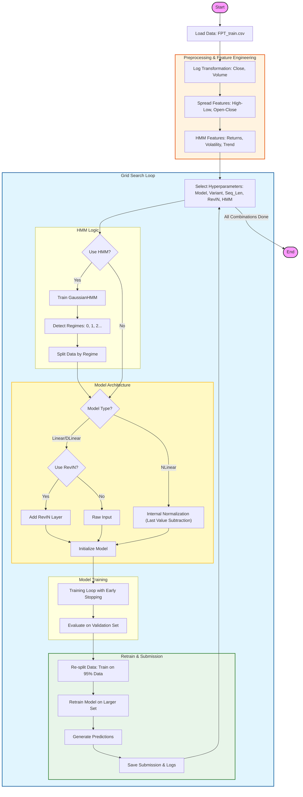

# 📈 Dự Đoán Giá Cổ Phiếu FPT - LTSF-Linear với Advanced Grid Search


## 📖 Tổng Quan (Overview)

Dự án này tập trung vào việc dự đoán giá đóng cửa của cổ phiếu **FPT** trong **100 ngày tiếp theo** sử dụng các kỹ thuật **Long-Term Time Series Forecasting (LTSF)** tiên tiến. Chúng tôi áp dụng các mô hình họ **Linear** (Linear, DLinear, NLinear) kết hợp với **Reversible Instance Normalization (RevIN)** và **Hidden Markov Model (HMM)** để xử lý sự thay đổi phân phối dữ liệu (distribution shift) và thích nghi với các chế độ thị trường (market regimes) khác nhau.

Mục tiêu chính là tìm ra cấu hình mô hình tối ưu thông qua **Grid Search** toàn diện trên không gian siêu tham số rộng lớn.

> [!TIP]
> **Chiến lược Kaggle**: Tận dụng giới hạn tối đa **500 submissions** của cuộc thi, chúng tôi thực hiện chiến lược "Vét cạn thông minh" (Smart Exhaustive Search). Thay vì chỉ chọn một vài mô hình tốt nhất, chúng tôi tạo ra hàng loạt biến thể để bao phủ mọi khả năng, từ đó tìm ra "Global Optima" thực sự cho bài toán dự báo này.

## 🚀 Tính Năng Chính (Key Features)

*   **Đa dạng Mô hình (Models)**: Hỗ trợ 3 biến thể hiện đại của Linear models:
    *   **Linear**: Mạng nơ-ron một lớp đơn giản nhưng hiệu quả.
    *   **DLinear**: Decomposition Linear - tách chuỗi thời gian thành Trend (xu hướng) và Seasonality (mùa vụ).
    *   **NLinear**: Normalization Linear - chuẩn hóa đầu vào bằng cách trừ đi giá trị cuối cùng.
*   **Biến thể (Variants)**:
    *   **Univariate**: Chỉ sử dụng chuỗi giá đóng cửa (`close_log`).
    *   **Multivariate**: Sử dụng thêm khối lượng (`volume_log`) và các chỉ số spread (`HL_Spread`, `OC_Spread`).
*   **Kỹ thuật Nâng cao**:
    *   **RevIN (Reversible Instance Normalization)**: Giải quyết vấn đề distribution shift bằng cách chuẩn hóa đầu vào và giải chuẩn hóa đầu ra, giúp mô hình học tốt hơn trên dữ liệu không dừng (non-stationary).
    *   **HMM (Hidden Markov Model)**: Phát hiện các trạng thái ẩn của thị trường (ví dụ: Tăng trưởng, Suy thoái, Đi ngang) dựa trên `returns`, `volatility`, và `trend`. Mô hình sẽ tự động chuyển đổi chiến lược dự đoán tùy theo trạng thái hiện tại.
*   **Tối ưu hóa (Optimization)**:
    *   **Grid Search**: Tự động thử nghiệm hàng trăm tổ hợp tham số (Sequence Length, Model Type, HMM Configs).
    *   **Early Stopping**: Ngăn chặn overfitting.
    *   **Learning Rate Scheduler**: Điều chỉnh tốc độ học động.

## 🔄 Quy Trình Xử Lý (Pipeline)

Biểu đồ dưới đây mô tả chi tiết luồng xử lý dữ liệu và huấn luyện mô hình trong `FPT_LTSF_GridSearch.ipynb`:



## 📂 Cấu Trúc Dự Án (Project Structure)

```
Project-6.1/
├── FPT_LTSF_GridSearch.ipynb       # Notebook chính: Grid Search toàn diện, EDA, và Training
├── testing_increas_pred_val.py     # Script: Tinh chỉnh độ dài dự đoán (Pred Len Tuning) và thử nghiệm HMM
├── data/
│   └── FPT_train.csv               # Dữ liệu lịch sử giá cổ phiếu FPT
├── submissions/                    # Thư mục chứa kết quả dự đoán (file .csv)
├── results/                        # Thư mục chứa logs và bảng tổng hợp kết quả
└── README.md                       # Tài liệu hướng dẫn chi tiết (File này)
```

### Chi tiết các file:
*   **`FPT_LTSF_GridSearch.ipynb`**: Đây là "bộ não" của dự án. Nó thực hiện:
    1.  Tải và tiền xử lý dữ liệu (Log transform, Feature engineering).
    2.  Định nghĩa các lớp mô hình (Linear, DLinear, NLinear) và RevIN.
    3.  Chạy vòng lặp Grid Search qua các tham số: `Seq_Len` (7, 15, ..., 480), `Model`, `Variant`, `HMM`.
    4.  Lưu kết quả tốt nhất vào thư mục `submissions/`.
*   **`testing_increas_pred_val.py`**: Một script Python độc lập dùng để kiểm thử chuyên sâu hơn về độ dài dự đoán (`Pred_Len`) và tinh chỉnh các tham số HMM (số lượng regime, window size).

## 🛠️ Cài Đặt & Yêu Cầu (Installation)

Dự án yêu cầu **Python 3.7+** và các thư viện sau:

```bash
pip install torch pandas numpy scikit-learn hmmlearn matplotlib seaborn tqdm
```

### Các thư viện chính:
*   `torch`: Framework Deep Learning.
*   `hmmlearn`: Thư viện cho Hidden Markov Models.
*   `pandas`, `numpy`: Xử lý dữ liệu.
*   `matplotlib`, `seaborn`: Trực quan hóa dữ liệu.

## 📖 Hướng Dẫn Sử Dụng (Usage)

### 1. Chạy Grid Search (Notebook)
Mở file `FPT_LTSF_GridSearch.ipynb` bằng Jupyter Notebook hoặc VS Code.
Chạy lần lượt các cell để:
*   Thực hiện EDA (Khám phá dữ liệu).
*   Huấn luyện các mô hình.
*   Xem biểu đồ phân loại Regime thị trường.
*   Kết quả dự đoán sẽ được lưu tự động.

### 2. Chạy Tinh chỉnh Pred Len (Script)
Chạy lệnh sau trong terminal:

```bash
python testing_increas_pred_val.py
```
Script này sẽ:
*   Thử nghiệm các độ dài dự đoán khác nhau: `[100, 120, 150, 200, 220]`.
*   Sử dụng cấu hình tốt nhất tìm được từ Grid Search.
*   In ra MSE (Mean Squared Error) trên tập validation.
*   Lưu file submission vào `submissions/pred_len_tuning/`.

## 🧠 Chi Tiết Phương Pháp (Methodology)

### Feature Engineering
Dữ liệu gốc được chuyển đổi và tạo đặc trưng mới để tăng tính ổn định và khả năng học của mô hình:

1.  **Log Transformation**:
    *   Công thức: $x' = \ln(x + 1)$
    *   **Công dụng**: Giảm độ lệch (skewness) của phân phối giá, giúp dữ liệu trở nên "gần chuẩn" (Gaussian-like) hơn, ổn định phương sai cho mô hình Linear.

2.  **Spread Features** (Biến động trong ngày):
    *   **HL_Spread (High-Low)**:
        *   Công thức: $S_{HL} = \ln(High) - \ln(Low)$
        *   **Công dụng**: Đo lường **biến động nội ngày** (Intraday Volatility). Giá trị càng lớn cho thấy thị trường càng giằng co mạnh.
    *   **OC_Spread (Open-Close)**:
        *   Công thức: $S_{OC} = \ln(Close) - \ln(Open)$
        *   **Công dụng**: Đo lường **động lực giá** (Price Momentum) và hướng di chuyển trong ngày (Dương = Tăng, Âm = Giảm).

3.  **HMM Features** (Đầu vào cho Regime Detection):
    *   **Returns**:
        *   Công thức: $R_t = \ln(Close_t) - \ln(Close_{t-1})$
        *   **Công dụng**: Tỷ suất sinh lời logarit, đặc trưng cơ bản nhất của chuỗi thời gian tài chính, có tính dừng (stationary) cao hơn giá gốc.
    *   **Volatility**:
        *   Công thức: $Vol_t = Std(R_{t-k}:R_t)$ (Độ lệch chuẩn lăn)
        *   **Công dụng**: Đo lường rủi ro thị trường. Volatility cao thường báo hiệu các giai đoạn bất ổn hoặc đảo chiều.
    *   **Trend**:
        *   Công thức: $Trend_t = MA(Close_t) - Close_t$ (hoặc các biến thể tương tự)
        *   **Công dụng**: Xác định xu hướng chủ đạo (Uptrend/Downtrend) để HMM phân loại trạng thái.

### Hidden Markov Model (HMM)
Chúng tôi sử dụng `GaussianHMM` để chia dữ liệu lịch sử thành các "Regime" (ví dụ: 3 regimes).
*   **Training**: Mỗi regime sẽ có một mô hình dự đoán riêng biệt được huấn luyện chuyên sâu trên dữ liệu thuộc regime đó.
*   **Inference**: Khi dự đoán, hệ thống xác định regime hiện tại và chọn mô hình tương ứng để đưa ra kết quả chính xác nhất.

## 📊 Kết Quả (Results)

Kết quả dự đoán (file `.csv`) bao gồm cột `id` (ngày dự đoán) và `close` (giá dự đoán đã được inverse transform về thang đo gốc).
Tên file kết quả chứa đầy đủ thông tin cấu hình, ví dụ:
`Sub_Multivariate_DLinear_RevIN_MSE_HMM3W60_Seq60_Pred100_ValMSE1234.csv`

## 📈 Phân Tích & Đánh Giá (Analysis & Insights)

Dựa trên các thử nghiệm mở rộng (xem chi tiết trong `FPT_LTSF_Comparison.ipynb` và `testing_increas_pred_val.py`), chúng tôi rút ra một số kết luận quan trọng:

1.  **Loss Function Tuning (Huber vs MSE)**:
    *   Việc thay thế hàm mất mát mặc định (MSE) bằng **Huber Loss** (để giảm tác động của outliers) **không mang lại sự cải thiện đáng kể** về độ chính xác (RMSE/MAE tương đương).
    *   Điều này cho thấy dữ liệu FPT đã được xử lý tốt bởi RevIN và không chứa quá nhiều nhiễu ngoại lai cực đoan ảnh hưởng đến quá trình huấn luyện.

2.  **Độ Dài Dự Đoán (Prediction Length)**:
    *   Việc tăng `pred_len` (từ 100 lên 120, 150...) **không tạo ra tác động lớn** đến hiệu suất mô hình.
    *   Mô hình vẫn duy trì được xu hướng dự đoán khá tốt ngay cả ở các chân trời dự báo xa hơn, chứng tỏ tính ổn định của kiến trúc Linear.

3.  **So Sánh MSE (Validation vs Hidden Test)**:
    *   **Quan sát**: Có sự chênh lệch rất lớn giữa `ValMSE` (thường > 4000) và `MSE` trên tập Hidden Test (~34).
    *   **Lý do**: `ValMSE` trong quá trình huấn luyện được tính trên dữ liệu đã qua xử lý (Log transform/RevIN), trong khi `MSE` trên Hidden Test được tính trên giá trị thực tế (Original Scale).
    *   **Ý nghĩa**: Không nên so sánh trực tiếp giá trị Loss khi training với sai số thực tế. Tuy nhiên, thứ hạng mô hình trên tập Validation thường tương đồng với kết quả trên tập Test, cho thấy mô hình học được các đặc trưng quan trọng mà không bị overfitting quá mức.

4.  **Kết Luận**:
    *   Mô hình **Linear cơ bản** kết hợp với **RevIN** và **MSE Loss** là cấu hình cân bằng nhất giữa hiệu năng và chi phí tính toán.
    *   Các kỹ thuật phức tạp hơn (như thay đổi Loss function hay tăng quá nhiều tham số) chưa cần thiết cho bài toán cụ thể này.

---
*Dự án được thực hiện nhằm mục đích nghiên cứu và học tập về Time Series Forecasting.*
