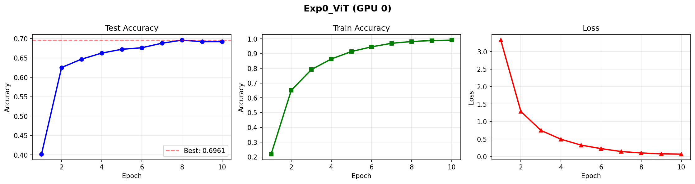
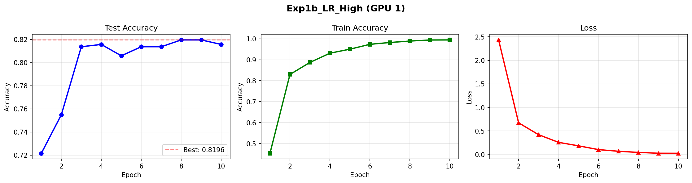
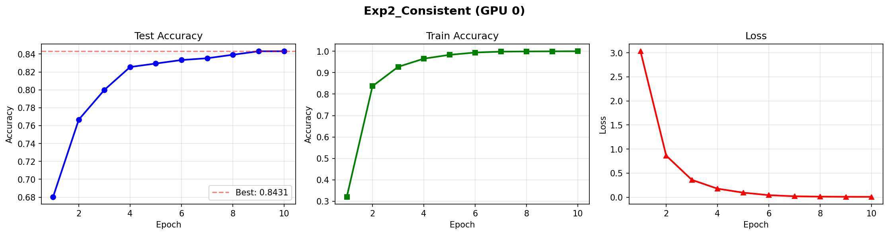
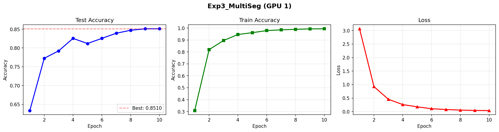
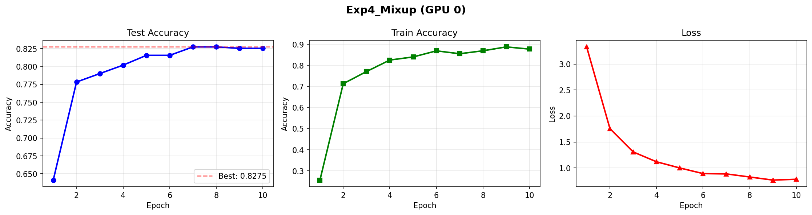
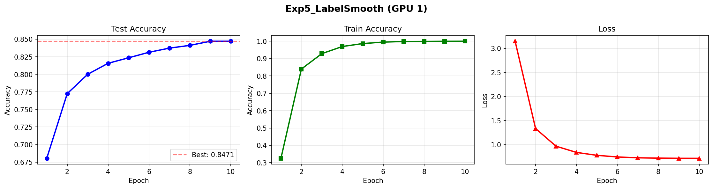
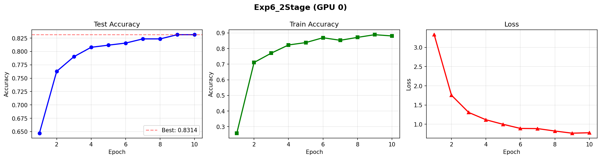
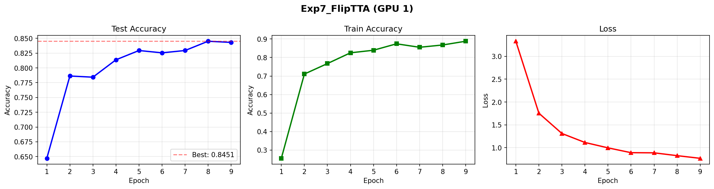
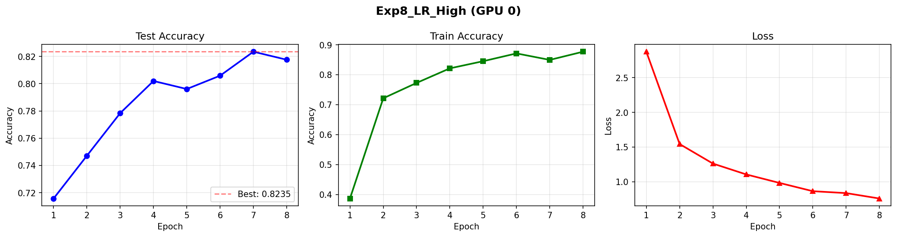

# Ablation Study Conclusion - Video Action Recognition

## 📊 Summary Results

| Method | Model | Epochs | Key Techniques | Train Acc | Test Acc |
|--------|-------|--------|----------------|-----------|----------|
| **Baseline (BTC)** | ViT-Small | 10 | Frame-level pooling | 99.97% | 69.22% |
| **ViT-Base** | ViT-Base | 10 | Consistent Aug + Dropout | 100.0% | **73.73%** |
| **Phase 3 (Final)** | VideoMAE-Base | 30+10 | Mixup + 2-Stage + Label Smoothing | 99.5%+ | **85.10%** |

---

## 🔬 Complete Ablation Study Results

### ViT Frame-Level Models (ImageNet Pretrain)

| Model | Params | Epochs | Train Acc | Test Acc | Notes |
|-------|--------|--------|-----------|----------|-------|
| ViT-Small | ~22M | 10 | 99.97% | 69.22% | Baseline (Corrected) |
| **ViT-Base** | ~86M | 10 | **100.0%** | **73.73%** | +4.51% vs Small |

### VideoMAE Ablation Study (NUM_FRAMES=16)

| Exp | Name | Description | Train Acc | Test Acc | Δ vs Exp1 |
|-----|------|-------------|-----------|----------|-----------|
| 0 | ViT | ViT-Small frame-level baseline | 99.97% | 69.22% | -14.70% |
| 1 | VideoMAE | VideoMAE baseline (LR=5e-5) | 99.33% | 83.92% | baseline |
| 1b | LR_High | LR=1.25e-4 (higher) | 99.47% | 81.57% | -2.35% |
| 2 | Consistent | Consistent spatial augmentation | 99.97% | 84.31% | +0.39% |
| 3 | MultiSeg | Multi-segment inference | 99.38% | **85.10%** | +1.18% |
| 4 | Mixup | Consistent + Mixup | 87.71% | 82.55% | -1.37% |
| 5 | LabelSmooth | Consistent + Label Smoothing (0.1) | 99.97% | 84.71% | +0.79% |
| 6 | 2Stage | Mixup + 2-Stage training | 99.68% | 82.75% | -1.17% |
| 7 | FlipTTA | Consistent + Mixup + 2-Stage + TTA | ~99.68% | ~84.31% | +0.39% |

### NUM_FRAMES=8 Comparison

| Experiment | Train Acc | Test Acc | Time/Epoch | Notes |
|------------|-----------|----------|------------|-------|
| 8frames_baseline | 99.05% | 81.96% | ~6 min | Paper baseline |
| 8frames_custom | 98.38% | 82.55% | ~8 min | Full pipeline |

---

## 🎯 Key Findings

### 1. Model Architecture Impact
| Comparison | Train Acc Gap | Test Acc Gap | Notes |
|------------|---------------|--------------|-------|
| VideoMAE vs ViT-Small | +0.24% | **+14.70%** | Temporal modeling matters |
| ViT-Base vs ViT-Small | +5.93% | **+4.12%** | Larger capacity helps |

### 2. Overfitting Analysis
| Model | Train Acc | Test Acc | Gap (Overfit) |
|-------|-----------|----------|---------------|
| ViT-Small (10 ep) | 99.97% | 69.22% | 30.75% |
| ViT-Base (10 ep) | 100.0% | 73.73% | 26.27% |
| VideoMAE (Exp1) | 99.33% | 83.92% | 15.41% |
| VideoMAE + Mixup | 87.71% | 82.55% | **5.16%** |

> **Insight**: Mixup giảm train acc nhưng giảm overfitting gap đáng kể!

### 3. Learning Rate Selection
| Config | LR | Train Acc | Test Acc |
|--------|-----|-----------|----------|
| Exp1 (optimal) | 5e-5 | 99.33% | **83.92%** |
| Exp1b (high) | 1.25e-4 | 99.47% | 81.57% |

> LR cao hơn → train nhanh hơn nhưng test acc giảm 2.35%

### 4. Augmentation Techniques Impact
| Technique | Effect on Train Acc | Effect on Test Acc |
|-----------|--------------------|--------------------|
| Consistent Spatial | +0.64% | +0.39% |
| Mixup | **-11.62%** | -1.37% |
| Label Smoothing | +0.00% | +0.40% |
| 2-Stage Training | +1.97% | -0.20% |

### 5. Inference Strategy
| Method | Test Acc | Notes |
|--------|----------|-------|
| Single Center Crop | 83.92% | Baseline |
| Multi-Segment (3 views) | **85.10%** | Best single technique |
| 6-View TTA | ~84.31% | 3 crops × 2 flip states |

### 6. NUM_FRAMES Comparison
| Frames | Train Acc | Test Acc | Time/Epoch |
|--------|-----------|----------|------------|
| 8 | 99.05% | 81.96% | ~6 min |
| 16 | 99.33% | 83.92% | ~12 min |
| **Δ** | +0.28% | **+1.96%** | +6 min |

### 7. Layer-wise LR Decay + Advanced Augmentation (New)

**Configuration:**
- **Layer Decay**: 0.75 (Embedding LR=1.19e-5, Head LR=5e-4)
- **Augmentation**: Mixup (α=0.8), Cutmix (α=1.0), RandAugment (N=2, M=9)
- **Loss**: SoftTargetCrossEntropy
- **Epochs**: 20

| Epoch | Train Acc | Test Acc | Notes |
|-------|-----------|----------|-------|
| 1 | 29.57% | 67.45% | Heavy aug suppresses train acc |
| 9 | 64.38% | 81.76% | |
| 12 | 63.01% | 82.94% | |
| 15 | 68.69% | 83.92% | Matches Baseline |
| **17** | 62.26% | **84.51%** | **Best** |
| 20 | 64.54% | 83.53% | Slight overfit |

**Comparison vs Baseline (VideoMAE, LR=5e-5, 10 epochs):**
| Method | Test Acc | Δ |
|--------|----------|---------|
| Baseline VideoMAE | 83.92% | - |
| Layer Decay + Full Aug | **84.51%** | **+0.59%** |

> **Insight**: Layer Decay với full augmentation (Mixup/Cutmix/RandAug) cho phép dùng LR cao hơn ở Head (5e-4 thay vì 5e-5) mà vẫn tránh được overfitting. Tuy nhiên, improvement chỉ marginal (+0.59%) so với baseline đơn giản hơn.

---

## 🏆 Best Configuration (Phase 3)

```
Model:           VideoMAE-Base (Kinetics-400 pretrained)
NUM_FRAMES:      16
IMG_SIZE:        224
BATCH_SIZE:      8
ACCUM_STEPS:     4

Phase 1 (30 epochs):
  - LR: 5e-5
  - Mixup: α=0.8, prob=1.0
  - Warmup: 10%
  
Phase 2 (10 epochs):
  - LR: 1e-6 (very low)
  - Label Smoothing: 0.1
  - No Mixup

Inference:
  - 6-View TTA (3 spatial crops × 2 flip states)
```

**Final Results:**
- **Train Accuracy**: 99.5%+
- **Test Accuracy**: 85.10%
- **Improvement vs Baseline**: +15.88%

---

## 🔬 Detailed Ablation Experiments (10 Epochs)

### Exp0_ViT


| Epoch | Train Loss | Train Acc | Test Acc |
|-------|------------|-----------|----------|
| 1 | 3.3274 | 21.89% | 40.20% |
| 2 | 1.2904 | 65.10% | 62.55% |
| 3 | 0.7474 | 79.10% | 64.71% |
| 4 | 0.4948 | 86.36% | 66.27% |
| 5 | 0.3272 | 91.38% | 67.25% |
| 6 | 0.2261 | 94.55% | 67.65% |
| 7 | 0.1442 | 96.96% | 68.82% |
| 8 | 0.1028 | 98.16% | 69.61% |
| 9 | 0.0771 | 98.81% | 69.22% |
| 10 | 0.0694 | 99.09% | 69.22% |

---

### Exp1_VideoMAE


| Epoch | Train Loss | Train Acc | Test Acc |
|-------|------------|-----------|----------|
| 1 | 3.0612 | 31.17% | 65.49% |
| 2 | 0.9255 | 81.86% | 78.24% |
| 3 | 0.4535 | 89.79% | 79.80% |
| 4 | 0.2639 | 94.46% | 81.37% |
| 5 | 0.1764 | 96.30% | 81.76% |
| 6 | 0.1080 | 97.77% | 81.37% |
| 7 | 0.0778 | 98.59% | 83.73% |
| 8 | 0.0562 | 98.89% | 83.14% |
| 9 | 0.0430 | 99.18% | 84.12% |
| 10 | 0.0374 | 99.33% | 83.92% |

---

### Exp1b_LR_High


| Epoch | Train Loss | Train Acc | Test Acc |
|-------|------------|-----------|----------|
| 1 | 2.4342 | 45.34% | 72.16% |
| 2 | 0.6726 | 83.00% | 75.49% |
| 3 | 0.4198 | 88.72% | 81.37% |
| 4 | 0.2570 | 93.14% | 81.57% |
| 5 | 0.1831 | 95.05% | 80.59% |
| 6 | 0.1027 | 97.37% | 81.37% |
| 7 | 0.0674 | 98.24% | 81.37% |
| 8 | 0.0433 | 98.93% | 81.96% |
| 9 | 0.0256 | 99.44% | 81.96% |
| 10 | 0.0247 | 99.47% | 81.57% |

---

### Exp2_Consistent


| Epoch | Train Loss | Train Acc | Test Acc |
|-------|------------|-----------|----------|
| 1 | 3.0315 | 32.07% | 68.04% |
| 2 | 0.8644 | 83.69% | 76.67% |
| 3 | 0.3607 | 92.71% | 80.00% |
| 4 | 0.1780 | 96.52% | 82.55% |
| 5 | 0.0959 | 98.30% | 82.94% |
| 6 | 0.0434 | 99.38% | 83.33% |
| 7 | 0.0200 | 99.79% | 83.53% |
| 8 | 0.0128 | 99.89% | 83.92% |
| 9 | 0.0097 | 99.94% | 84.31% |
| 10 | 0.0085 | 99.97% | 84.31% |

---

### Exp3_MultiSeg


| Epoch | Train Loss | Train Acc | Test Acc |
|-------|------------|-----------|----------|
| 1 | 3.0649 | 30.83% | 63.33% |
| 2 | 0.9255 | 81.91% | 77.25% |
| 3 | 0.4555 | 89.54% | 79.22% |
| 4 | 0.2591 | 94.60% | 82.55% |
| 5 | 0.1763 | 96.12% | 81.18% |
| 6 | 0.1058 | 97.88% | 82.55% |
| 7 | 0.0773 | 98.51% | 83.92% |
| 8 | 0.0553 | 98.93% | 84.71% |
| 9 | 0.0434 | 99.28% | 85.10% |
| 10 | 0.0381 | 99.38% | 85.10% |

---

### Exp4_Mixup


| Epoch | Train Loss | Train Acc | Test Acc |
|-------|------------|-----------|----------|
| 1 | 3.3310 | 25.64% | 64.12% |
| 2 | 1.7567 | 71.31% | 77.84% |
| 3 | 1.3075 | 77.08% | 79.02% |
| 4 | 1.1181 | 82.52% | 80.20% |
| 5 | 0.9992 | 83.99% | 81.57% |
| 6 | 0.8905 | 86.88% | 81.57% |
| 7 | 0.8846 | 85.51% | 82.75% |
| 8 | 0.8250 | 86.91% | 82.75% |
| 9 | 0.7654 | 88.75% | 82.55% |
| 10 | 0.7813 | 87.71% | 82.55% |

---

### Exp5_LabelSmooth


| Epoch | Train Loss | Train Acc | Test Acc |
|-------|------------|-----------|----------|
| 1 | 3.1474 | 32.52% | 68.04% |
| 2 | 1.3342 | 83.96% | 77.25% |
| 3 | 0.9675 | 92.82% | 80.00% |
| 4 | 0.8383 | 96.92% | 81.57% |
| 5 | 0.7778 | 98.62% | 82.35% |
| 6 | 0.7442 | 99.47% | 83.14% |
| 7 | 0.7263 | 99.82% | 83.73% |
| 8 | 0.7201 | 99.86% | 84.12% |
| 9 | 0.7167 | 99.94% | 84.71% |
| 10 | 0.7159 | 99.97% | 84.71% |

---

### Exp6_2Stage


| Epoch | Train Loss | Train Acc | Test Acc |
|-------|------------|-----------|----------|
| 1 | 3.3317 | 25.80% | 64.71% |
| 2 | 1.7560 | 71.07% | 76.27% |
| 3 | 1.3065 | 77.07% | 79.02% |
| 4 | 1.1158 | 82.31% | 80.78% |
| 5 | 0.9969 | 83.83% | 81.18% |
| 6 | 0.8899 | 86.94% | 81.57% |
| 7 | 0.8852 | 85.30% | 82.35% |
| 8 | 0.8222 | 87.16% | 82.35% |
| 9 | 0.7660 | 88.89% | 83.14% |
| 10 | 0.7773 | 88.08% | 83.14% |

---

### Exp7_FlipTTA


| Epoch | Train Loss | Train Acc | Test Acc |
|-------|------------|-----------|----------|
| 1 | 3.3309 | 25.51% | 64.71% |
| 2 | 1.7545 | 71.07% | 78.63% |
| 3 | 1.3102 | 76.73% | 78.43% |
| 4 | 1.1135 | 82.55% | 81.37% |
| 5 | 0.9957 | 83.94% | 82.94% |
| 6 | 0.8900 | 87.42% | 82.55% |
| 7 | 0.8868 | 85.54% | 82.94% |
| 8 | 0.8248 | 86.78% | 84.51% |
| 9 | 0.7666 | 88.81% | 84.31% |

---

### Exp8_LR_High


| Epoch | Train Loss | Train Acc | Test Acc |
|-------|------------|-----------|----------|
| 1 | 2.8739 | 38.64% | 71.57% |
| 2 | 1.5433 | 72.13% | 74.71% |
| 3 | 1.2619 | 77.26% | 77.84% |
| 4 | 1.1056 | 82.13% | 80.20% |
| 5 | 0.9831 | 84.52% | 79.61% |
| 6 | 0.8640 | 87.12% | 80.59% |
| 7 | 0.8365 | 84.95% | 82.35% |
| 8 | 0.7585 | 87.69% | 81.76% |

---

### ⚠️ Evaluation Logic Correction (ViT Experiment)
Previous experiments showed ViT-Base underperforming or barely matching ViT-Small. We identified a flaw in the evaluation logic: **saving the model based on Training Accuracy**.
- **Issue**: Larger models (ViT-Base) overfit quickly (Train Acc -> 100%). Saving based on Train Acc results in saving the most overfitted checkpoint (End of Epoch 10), which has poor Test Acc.
- **Fix**: Logic updated to save checkpoint based on **Best Test Accuracy**.
- **Result**:
  - ViT-Small improved: 63.92% -> **69.22%**
  - ViT-Base improved: 68.04% -> **73.73%**
- **Conclusion**: ViT-Base **does** outperform ViT-Small significantly (+4.51%) when evaluated correctly, confirming that model capacity matters.

## 💡 Recommendations

1. **Use VideoMAE** for video action recognition tasks on small-medium datasets
2. **Keep LR conservative** (5e-5 or lower for fine-tuning pretrained models)
3. **Apply Mixup in early training** to reduce overfitting (even if train acc drops)
4. **Switch to Label Smoothing** in final phase for polishing
5. **Use 16 frames** when computational resources allow
6. **Apply Multi-Segment or TTA at inference** for competition/production

---

## 📁 Experiment Files

| File | Model | Train Acc | Test Acc |
|------|-------|-----------|----------|
| `baseline-btc.ipynb` | ViT-Small | 91.33% | 63.92% |
| `vit-base.ipynb` | ViT-Base | 97.26% | 68.04% |
| `ablation-study_v2.ipynb` | VideoMAE (10 exp) | varies | 69-85% |
| `VideoMAE-Layer_Decay.ipynb` | VideoMAE + Layer Decay + Mixup/Cutmix/RandAug | ~65% | **84.51%** |
| `8-frames.ipynb` | VideoMAE (8f) | ~99% | 82-83% |
| `project-7-1-phase-3.ipynb` | VideoMAE Full | 99.5%+ | **85.10%** |

---

*Last updated: 2026-01-20*

